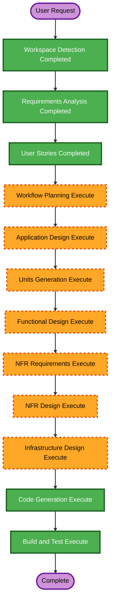

# Execution Plan - Safe Prompt Guard

## Detailed Analysis Summary

### Project Context

- **Project Type**: Greenfield web app
- **Primary Goal**: Build a working Safe Prompt Guard MVP from the latest PRD.
- **Core Flow**: Paste -> Scan -> Fix -> Safe Review -> Copy
- **Custom Flow**: Custom Rule -> Preview -> Apply to Session -> Scan

### Change Impact Assessment

- **User-facing changes**: Yes. The entire MVP is a new user-facing workflow.
- **Structural changes**: Yes. The project needs frontend, API functions, shared core logic, tests, and deployment-ready structure.
- **Data model changes**: Yes. Rule, Finding, TransformPreview, scan/mask request and response models are required.
- **API changes**: Yes. Four MVP endpoints are required: scan, mask, rules preview, and safe review.
- **NFR impact**: Yes. Security, privacy, performance, accessibility, and deployment readiness are central requirements.

### Risk Assessment

- **Risk Level**: Medium
- **Rollback Complexity**: Easy while greenfield; no production data or deployed state exists yet.
- **Testing Complexity**: Moderate because scan/mask logic has range handling, overlapping findings, transform scopes, and security-sensitive behavior.
- **Primary Risks**:
  - Accidentally sending original prompt content to AI review.
  - Logging raw prompt or secret-like data.
  - Regex overlap and index shift bugs.
  - Copilot SDK integration uncertainty under hackathon time constraints.

## Recommended Phase Decisions

### INCEPTION PHASE

| Stage | Decision | Rationale |
|---|---|---|
| Workspace Detection | Completed | Greenfield app workspace detected. |
| Reverse Engineering | Skipped | No application code exists yet. |
| Requirements Analysis | Completed | PRD, extension decisions, and acceptance criteria captured. |
| User Stories | Completed | New user-facing workflow required stories and personas. |
| Workflow Planning | Execute | Needed to select construction path before code generation. |
| Application Design | Execute | New frontend, API, shared core, test, and deployment structure need component boundaries. |
| Units Generation | Execute | Work should be split into frontend, API/core logic, Rule Builder/Copilot adapter, tests/docs/deployment readiness. |

### CONSTRUCTION PHASE

| Stage | Decision | Rationale |
|---|---|---|
| Functional Design | Execute | Scan, mask, transform, overlap, custom rule, and Safe Review behaviors need detailed design. |
| NFR Requirements | Execute | Security baseline, PBT partial enforcement, Azure readiness, and privacy requirements affect implementation. |
| NFR Design | Execute | Need concrete validation, logging, error handling, adapter, and test patterns. |
| Infrastructure Design | Execute | Azure Static Web Apps and Azure Functions layout must be mapped before build. |
| Code Generation | Execute | Required to scaffold and implement the MVP. |
| Build and Test | Execute | Required to verify local build, tests, scan/mask behavior, and app startup. |

### OPERATIONS PHASE

| Stage | Decision | Rationale |
|---|---|---|
| Operations | Placeholder | Deployment execution is outside the current AI-DLC operations workflow, but Azure deployment readiness will be documented. |

## Workflow Visualization

### Mermaid Diagram

### Text Alternative

1. Workspace Detection: completed
2. Requirements Analysis: completed
3. User Stories: completed
4. Workflow Planning: execute now
5. Application Design: execute next
6. Units Generation: execute
7. Functional Design: execute
8. NFR Requirements: execute
9. NFR Design: execute
10. Infrastructure Design: execute
11. Code Generation: execute
12. Build and Test: execute

## Units To Generate

Recommended units for the implementation plan:

1. **Project Scaffold and Shared Types**
   - Vite React TypeScript app
   - Azure Functions API layout
   - Shared TypeScript models

2. **Core Scan and Transform Engine**
   - Built-in rules
   - Finding overlap resolution
   - Transform preview and apply logic
   - Example and property-based tests

3. **API Functions**
   - `/api/scan`
   - `/api/mask`
   - `/api/rules/preview`
   - `/api/safe-review`
   - Input validation and safe errors

4. **Frontend Prompt Guard UX**
   - Prompt input
   - Highlight preview
   - Global Fix Bar
   - Findings Panel
   - Safe Output Preview and Copy

5. **Custom Rule Builder and Copilot Adapter**
   - Dummy example input
   - Pre-scan warning
   - Copilot SDK target integration
   - Rule preview and approval
   - Session custom rules

6. **Verification and Documentation**
   - Tests
   - README
   - Azure deployment notes
   - Security and PBT compliance notes

## Quality Gates

- Local app starts successfully.
- TypeScript build passes.
- Unit tests pass.
- Core scan/transform tests cover demo prompt behavior.
- Partial PBT uses `fast-check` for core invariants.
- API handlers validate input and avoid raw prompt logging.
- Safe Review receives transformed text only.
- Demo flow works end to end.

## Security Compliance

| Rule | Status | Notes |
|---|---|---|
| SECURITY-03 | Compliant in plan | No raw prompt or secret logging. |
| SECURITY-04 | Planned | Deployment notes or config must address security headers. |
| SECURITY-05 | Planned | API input schemas and length limits are required. |
| SECURITY-09 | Planned | Safe production-style error responses required. |
| SECURITY-10 | Planned | Lock file, audit guidance, trusted dependencies required. |
| SECURITY-11 | Planned | Security-sensitive logic isolated in core modules. |
| SECURITY-15 | Planned | API fail-closed behavior and safe error handling required. |
| Other SECURITY rules | N/A | No auth, database, custom IAM, or persistent data store in MVP. |

No blocking security finding is present in this execution plan.

## PBT Compliance

| Rule | Status | Notes |
|---|---|---|
| PBT-02 | Planned where applicable | Round-trip tests only if serialization helpers are introduced. |
| PBT-03 | Planned | Invariant tests for scan/mask/transform. |
| PBT-07 | Planned | Domain-specific generators for text snippets, rules, findings, transforms. |
| PBT-08 | Planned | Shrinking and reproducible seeds via `fast-check`. |
| PBT-09 | Planned | `fast-check` selected for TypeScript. |

No blocking PBT finding is present in this execution plan.

## Estimated Timeline

- **AI-DLC remaining planning/design**: short, focused artifacts only.
- **Implementation**: scaffold first, then core/API, then UI, then tests and docs.
- **Demo readiness goal**: prioritize end-to-end local demo before optional polish.

## Next Stage

Application Design.